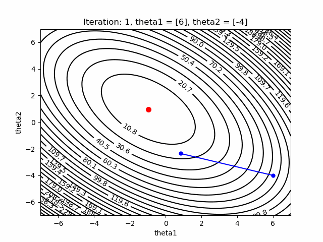
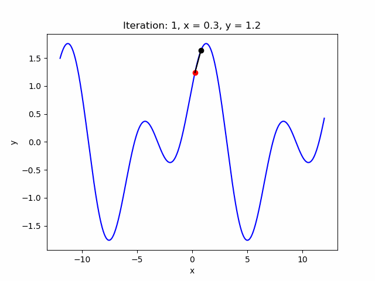
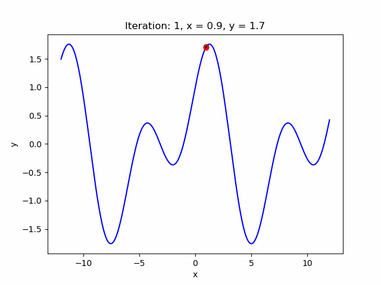

# Examples of Gradient Descent

The repository shows some application of Gradient Descent algorithms in finding local/global optimum in simple settings. The below figures illustrate the speed of convergence to local/global optimum of objective functions by changing values of learning rate and decay factor.

Example 1: Estimate the coefficients of the linear regression model.

Example 2: Find the optimum of function `y = sin(x) + cos(x/2)`.

